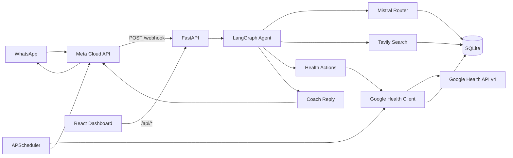

# WhatsApp AI Health Coach

A local, open-source WhatsApp health coach that turns natural-language messages and **food photos** into structured health actions. It uses a **multi-agent LangGraph** workflow with **Google Gemini** (vision + routing), reads and writes data via the **Google Health API v4**, looks up nutrition from trusted web sources with **Tavily**, and ships with a **React observability dashboard**.

Built for personal, single-user use: FastAPI on your machine, `ngrok` for the webhook, Google OAuth in the browser, and all times interpreted in **Hong Kong time (HKT)** by default.

## Features

- **WhatsApp coaching** — log meals, hydration, weight; query sleep, steps, workouts, and trends
- **Smart nutrition lookup** — Tavily searches USDA, Nutritionix, and other trusted sources before logging calories
- **General sourced answers** — ask non-logging health questions and get Tavily-backed source links
- **Normalized Google Health summaries** — large API payloads are compacted by data type before LLM summarization
- **Lookup vs log** — ask nutrition facts without writing to Google Health; log only when you explicitly want to save a meal
- **LangGraph agent** — route intent → nutrition search → Google Health action → coach reply
- **Local dashboard** — messages, LLM calls, Google API calls, Tavily searches, and response visualizations
- **Conversation memory** — recent WhatsApp turns persisted in SQLite and included in router prompts
- **Scheduled summaries** — optional morning/evening HKT coaching messages via WhatsApp

## Architecture



## Project structure

```
.
├── backend/health_coach/
│   ├── app.py                 # FastAPI entrypoint
│   ├── api/                   # HTTP routes
│   │   ├── dashboard.py       # /api/* observability endpoints
│   │   └── webhook.py         # WhatsApp webhook
│   ├── agent/                 # LangGraph + Mistral
│   │   ├── engine.py          # Intent router & macro resolver
│   │   ├── graph.py           # Agent workflow
│   │   └── actions.py         # Google Health dispatch
│   ├── integrations/          # External APIs
│   │   ├── google_health.py   # Google Health API v4 client
│   │   ├── google_auth.py     # OAuth token flow
│   │   ├── nutrition.py       # Tavily nutrition search
│   │   ├── research.py        # Tavily general health research
│   │   └── whatsapp.py        # Meta WhatsApp client
│   ├── core/                  # Shared primitives
│   │   ├── database.py        # SQLite schema & persistence
│   │   ├── types.py           # Data type normalization
│   │   ├── payloads.py        # Google Health payload builders
│   │   ├── timezone.py        # HKT-first time handling
│   │   ├── health_normalizer.py # Compact Google Health payloads for LLMs
│   │   └── analytics.py       # Dashboard aggregations
│   ├── services/              # Background features
│   │   ├── memory.py          # Conversation history
│   │   ├── coaching.py        # Readiness & daily summaries
│   │   └── scheduler.py       # Morning/evening jobs
│   └── examples/
│       └── mock_payloads.py   # Sample Google Health payloads
├── frontend/                  # React + Vite dashboard
├── tests/
├── scripts/dev.sh             # Start backend + frontend
├── data/                      # Local SQLite (gitignored)
├── main.py                    # uvicorn compatibility shim
└── requirements.txt
```

## Tech stack

| Layer | Technology |
| --- | --- |
| API | FastAPI, Uvicorn |
| Agent | LangGraph, Mistral |
| Nutrition search | Tavily |
| Health data | Google Health API v4 |
| Messaging | Meta WhatsApp Cloud API |
| Storage | SQLite |
| Dashboard | React, Vite, Recharts |
| Scheduler | APScheduler |

## Quick start

### 1. Install dependencies

```bash
python3 -m pip install -r requirements.txt
cd frontend && npm install && cd ..
```

### 2. Configure environment

Copy `.env.example` to `.env` and fill in your keys:

```bash
cp .env.example .env
```

Required: `GEMINI_API_KEY`, `WHATSAPP_*`, `TAVILY_API_KEY` (free at [tavily.com](https://tavily.com))

### LLM provider (Google Gemini)

The multi-agent coach uses **[Google Gemini](https://aistudio.google.com/)** for vision, intent routing, nutrition macro resolution, Google Health summarization, and Tavily-backed research answers. Create a free API key at [aistudio.google.com/apikey](https://aistudio.google.com/apikey) and set `GEMINI_API_KEY` in `.env`. Default model: `gemini-2.5-flash` (`GEMINI_MODEL`).

**Multi-agent flow:**
- **Vision agent** — analyzes WhatsApp food photos (`agent/vision.py`)
- **Router agent** — text intent + payload (`agent/engine.py`)
- **Nutrition agent** — Tavily lookup + macro resolution
- **Research agent** — sourced general wellness Q&A
- **Health sync + summarizer** — Google Health API + coach reply

Send a meal photo on WhatsApp — by default the vision agent identifies the food and returns nutrition info **without logging**. Add a caption like `log this` or `save to my app` if you want it written to Google Health.

Rate-limit handling:

| Variable | Default | Purpose |
| --- | --- | --- |
| `GEMINI_CALL_DELAY_SECONDS` | `2` | Minimum spacing before and after each Gemini call |
| `GEMINI_RATE_LIMIT_MAX_RETRIES` | `3` | Retries on HTTP 429 / quota errors |
| `GEMINI_RATE_LIMIT_BACKOFF_SECONDS` | `2` | Base delay for exponential backoff (2s → 4s → 8s) |

If you hit free-tier limits, increase `GEMINI_CALL_DELAY_SECONDS` to `3`–`5`.

### 3. Google OAuth credentials

Create an OAuth desktop client in Google Cloud, enable the Google Health API scopes you need, and download the client JSON.

Place it in the project root as:

```text
credentials.json
```

Then run:

```bash
python3 -m backend.health_coach.integrations.google_auth
```

This opens a browser consent flow and writes:

```text
token.json
```

Both files are local secrets and are ignored by git:

- `credentials.json` contains your OAuth client secret
- `token.json` contains access/refresh tokens

### 4. Meta WhatsApp Cloud API setup

Create or use a Meta developer app with WhatsApp Cloud API enabled.

For local development, Meta's **API Setup** page can generate a temporary access token and test phone number ID. Add these to `.env`:

```bash
WHATSAPP_ACCESS_TOKEN=replace-me
WHATSAPP_PHONE_NUMBER_ID=replace-me
WHATSAPP_VERIFY_TOKEN=replace-me
WHATSAPP_API_VERSION=v25.0
```

For always-on use, create a **Meta Business System User** token instead of relying on the temporary token:

1. Go to Meta Business Settings.
2. Create a System User.
3. Assign the WhatsApp app and WhatsApp Business Account assets.
4. Generate a System User access token with:
   - `whatsapp_business_messaging`
   - `whatsapp_business_management`
5. Store that token as `WHATSAPP_ACCESS_TOKEN` in `.env`.

Expose your local backend with ngrok:

```bash
ngrok http 8000
```

Then set your Meta webhook callback URL to:

```text
https://<ngrok-domain>/webhook
```

Use the same value from `.env` for the webhook verify token.

### 5. Run locally

```bash
# Backend
python3 -m uvicorn backend.health_coach.app:app --host 0.0.0.0 --port 8000

# Dashboard (separate terminal)
cd frontend && npm run dev

# Or both at once
chmod +x scripts/dev.sh && ./scripts/dev.sh
```

Open the dashboard at **http://localhost:5173** during development. After running `npm run build`, FastAPI also serves the built dashboard at **http://localhost:8000**.

## Supported intents

| Intent | Example | Action |
| --- | --- | --- |
| `QUERY_NUTRITION` | `how many calories in 2 chapatis?` | Tavily lookup only — no app logging |
| `LOG_NUTRITION` | `log 2 chapatis for dinner` / `I had eggs for breakfast` | Search + write `nutrition-log` |
| `UPDATE_NUTRITION` | `correct chapati dinner to 10:30 pm yesterday` | Patch or replace meal log |
| `LOG_HYDRATION` | `drank 500ml water` | Create `hydration-log` |
| `LOG_WEIGHT` | `weighed 75kg this morning` | Create `weight` |
| `QUERY_HISTORY` | `last few activities` | List raw records |
| `QUERY_TRENDS` | `steps in the last two days` | Rollup / reconcile |
| `QUERY_SLEEP` | `how did I sleep this week` | Reconcile sleep |
| `GENERAL_RESEARCH` | `how much REM sleep do adults need? cite sources` | Tavily-backed answer only |
| `COACHING_CHAT` | `motivate me today` | Coach-only reply |

## Dashboard

Two top-level tabs:

- **Health Overview** — readiness, steps, active zone minutes, sleep, meals, hydration, coach summary, recommendations
- **Technical Details** — system stats, messages, LLM calls, Google Health calls, Tavily searches, actions, jobs, raw metrics

The dashboard is served by FastAPI at `/` after `npm run build`, and by Vite at `http://localhost:5173` during development.

API endpoints include `/api/health/overview`, `/api/health/trends`, `/api/technical/summary`, `/api/messages`, `/api/llm-calls`, `/api/google-health-calls`, `/api/tavily-calls`, `/api/health-actions`, and more.

## Nutrition lookup behavior

1. Router extracts food + portion (no guessed calories)
2. Tavily searches trusted nutrition databases
3. Mistral resolves macros, validates sanity, and includes source URLs
4. **Lookup only** (`QUERY_NUTRITION`) — shares facts, offers to log if you want
5. **Logging** (`LOG_NUTRITION`) — writes to Google Health with cited sources

## General research behavior

- If you ask for general health guidance and request sources, the bot uses Tavily research search.
- It does **not** log anything for `GENERAL_RESEARCH` or `COACHING_CHAT`.
- Phrases like `don't log`, `just curious`, and `lookup only` prevent write actions.

## Google Health summarization

Google Health responses are stored raw in SQLite for debugging, but the LLM receives compact normalized summaries. Supported normalizers include sleep, steps, active zone minutes, exercise, heart rate, resting heart rate, nutrition, hydration, and weight. This avoids truncating large payloads such as sleep stage timelines.

## Testing

```bash
python3 -m pytest -q
cd frontend && npm run build
```

## Security

**Never commit:**

- `.env`
- `credentials.json`
- `token.json`

These contain API keys, OAuth secrets, or refresh tokens. They are listed in `.gitignore`.

Before your first push, verify they are ignored:

```bash
git status --short
```

You should not see `.env`, `credentials.json`, or `token.json` in the staged or untracked file list.

## License

MIT — see [LICENSE](LICENSE).
