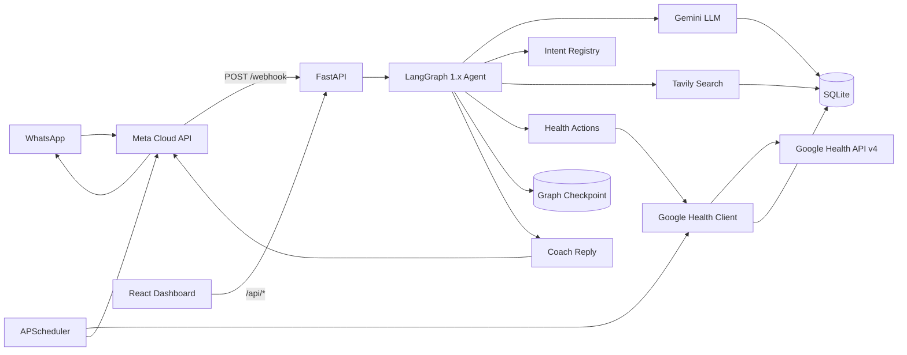

# WhatsApp AI Health Coach

A local, open-source WhatsApp health coach that turns natural-language messages and **food photos** into structured health actions. It uses a **LangGraph 1.x** workflow with **Google Gemini** (vision + routing), reads and writes data via the **Google Health API v4**, looks up nutrition from trusted web sources with **Tavily**, and ships with a **React observability dashboard**.

Built for personal, single-user use: FastAPI on your machine, `ngrok` for the webhook, Google OAuth in the browser, and all times interpreted in **Hong Kong time (HKT)** by default.

## Features

- **WhatsApp coaching** — log meals (including **batch multi-item** in one message), hydration, weight, and **workouts**; query sleep, steps, and trends
- **Voice notes & documents** — transcribe voice messages; summarize medical PDFs/images via Gemini
- **Weekly fitness plans** — co-create text step-by-step workouts stored locally; mark complete and sync to Google Health
- **Mood & cycle tracking** — stored locally until Google Health API adds Mindfulness / Women's Health (Q3 2026)
- **Smart nutrition lookup** — Tavily searches USDA, Nutritionix, and other trusted sources before logging calories
- **Exercise calorie lookup** — Tavily + LLM estimates active burn (personalized to your weight) before workout logging; MET fallback if search is weak
- **Weekly weight nudge** — WhatsApp reminder to log weight; syncs to Google Health + local history for calorie estimates
- **Confirm-before-log** — low-confidence nutrition and food photos pause for Confirm/Skip (LangGraph `interrupt()` + WhatsApp buttons)
- **Undo last log** — `undo` / `UNDO_LAST_LOG` removes the most recent coach-created Google Health entry
- **Async webhook** — returns 200 immediately; deduplicates Meta retries to prevent duplicate replies
- **General sourced answers** — Tavily-backed research for health questions
- **Normalized Google Health summaries** — compact API payloads before LLM summarization
- **Lookup vs log** — nutrition facts without writing to Google Health unless you ask to save
- **LangGraph agent** — declarative intent registry → nutrition / health / research pipelines → coach reply
- **Parallel batch nutrition** — LangGraph `Send` API for multi-item meal lookups
- **Local dashboard** — readiness, goals, plan adherence, scheduled nudge times, plus technical observability
- **Conversation memory** — recent WhatsApp turns in SQLite; extended turns for coaching intents
- **Coaching focus** — persistent multi-day thread context (e.g. "help me cut carbs this week")
- **Goal-aware coaching** — active goals + daily progress injected into every LLM prompt and evening summaries
- **Rich readiness** — sleep duration/stages, resting HR, active zone minutes (not just step counts)
- **Scheduled coaching** — morning/evening summaries, readiness nudge, workout adherence nudge, weekly weight reminder, weekly recap

## Google Health Coach parity

| Feature | Official Google Health Coach | This bot |
| --- | --- | --- |
| Conversational logging (text/voice/photo) | In-app | WhatsApp text, voice, food photos, documents |
| Multiple items in one message | Yes | Yes (`items[]` batch nutrition, parallel lookup) |
| Workout logging | Yes | Yes (`LOG_EXERCISE` → Google Health API) |
| Weekly fitness plans | In-app Fitness tab | Local SQLite + WhatsApp text workouts |
| Exercise video library | Licensed trainer videos | Text step-by-step only |
| Medical record summary | In-app | Document/PDF via WhatsApp + Gemini |
| Mood / cycle sync | In-app | Local SQLite (API write expected Q3 2026) |
| Proactive coaching | Readiness-based | Sleep/RHR-aware readiness + summaries + nudges |
| Hong Kong availability | Geo-blocked | **Yes** |
| Third-party sync (MFP, etc.) | Yes | Not included |

## Architecture



## Project structure

```
.
├── backend/health_coach/
│   ├── app.py                 # FastAPI entrypoint
│   ├── api/                   # HTTP routes
│   │   ├── dashboard.py       # /api/* observability endpoints
│   │   ├── webhook.py         # WhatsApp webhook
│   │   ├── webhook_processor.py
│   │   └── google_oauth.py    # Mobile OAuth for token refresh
│   ├── agent/                 # LangGraph + Gemini
│   │   ├── engine.py          # Intent router & macro resolver
│   │   ├── graph.py           # Agent workflow (checkpointer + interrupt)
│   │   ├── intent_registry.py # Declarative intent → pipeline routing
│   │   ├── subgraphs.py       # Composable pipeline subgraphs
│   │   ├── actions.py         # Google Health dispatch + undo
│   │   └── vision.py          # Food photo analysis
│   ├── integrations/          # External APIs
│   │   ├── llm/               # Pluggable LLM (Gemini default, Mistral)
│   │   ├── google_health.py   # Google Health API v4 client
│   │   ├── google_auth.py     # OAuth token flow
│   │   ├── nutrition.py       # Tavily nutrition search
│   │   ├── exercise.py        # Tavily exercise calorie search
│   │   ├── research.py        # Tavily general health research
│   │   └── whatsapp.py        # Meta WhatsApp client + templates/buttons
│   ├── core/                  # Shared primitives
│   │   ├── database.py        # SQLite schema & persistence
│   │   ├── health_retry.py    # Google Health 400 retry + LLM fix
│   │   ├── payloads.py        # Google Health payload builders
│   │   ├── timezone.py        # HKT-first time handling
│   │   ├── health_normalizer.py
│   │   └── analytics.py       # Dashboard aggregations
│   ├── services/              # Background features
│   │   ├── memory.py          # Conversation history
│   │   ├── coaching.py        # Readiness, summaries, weekly recap
│   │   ├── coaching_preferences.py  # Persistent coaching focus
│   │   ├── goal_progress.py   # Goal progress from Google Health rollups
│   │   ├── scheduler.py       # Morning/evening/nudge/recap jobs
│   │   ├── fitness_plans.py   # Weekly workout plans
│   │   ├── user_goals.py      # Goal storage
│   │   └── llm_context.py     # Shared prompt context
│   └── examples/
├── frontend/                  # React + Vite dashboard
├── tests/
├── scripts/dev.sh             # Start backend + frontend
├── data/                      # Local SQLite (gitignored)
├── main.py                    # uvicorn compatibility shim
└── requirements.txt
```

## Tech stack

| Layer | Technology |
| --- | --- |
| API | FastAPI, Uvicorn |
| Agent | LangGraph 1.x (checkpointer, interrupt, Send) |
| LLM | Gemini (default), Mistral optional |
| Nutrition search | Tavily |
| Health data | Google Health API v4 |
| Messaging | Meta WhatsApp Cloud API |
| Storage | SQLite |
| Dashboard | React, Vite, Recharts |
| Scheduler | APScheduler |

## Quick start

### 1. Install dependencies

```bash
python3 -m pip install -r requirements.txt
cd frontend && npm install && cd ..
```

### 2. Configure environment

Copy `.env.example` to `.env` and fill in your keys:

```bash
cp .env.example .env
```

Required: `GEMINI_API_KEY`, `WHATSAPP_*`, `TAVILY_API_KEY` (free at [tavily.com](https://tavily.com))

### LLM provider (pluggable)

The LLM layer is **provider-agnostic** (`backend/health_coach/integrations/llm/`). LangGraph, prompts, and Google Health logic stay the same — only the vendor client swaps.

| `LLM_PROVIDER` | Status | Notes |
| --- | --- | --- |
| `gemini` (default) | Built-in | Vision + JSON. Set `GEMINI_API_KEY` |
| `mistral` | Built-in | Text/JSON only (`pip install mistralai`). Set `MISTRAL_API_KEY` |
| `openai` | Add later | Implement `OpenAIProvider` in `integrations/llm/` |

Default: **Gemini** (`gemini-2.5-flash`). Create a free key at [aistudio.google.com/apikey](https://aistudio.google.com/apikey) and set `GEMINI_API_KEY` in `.env`.

**Automatic failover (Gemini → Mistral):** set `LLM_FALLBACK_PROVIDER=mistral` with both API keys configured. Text routing, nutrition resolution, and summaries fall back to Mistral when Gemini hits rate limits or outages. Food photos and voice notes still use Gemini (Mistral has no vision). Mistral uses its own rate-limit spacing (`MISTRAL_CALL_DELAY_SECONDS`, default `2`).

**Multi-agent flow:**
- **Vision agent** — analyzes WhatsApp food photos (`agent/vision.py`)
- **Router agent** — text intent + payload (`agent/engine.py`)
- **Intent registry** — routes to nutrition / health / research pipelines (`agent/intent_registry.py`)
- **Nutrition agent** — Tavily lookup + macro resolution (parallel batch via `Send`)
- **Exercise agent** — Tavily calorie lookup + LLM resolution (personalized to your weight; MET fallback)
- **Research agent** — sourced general wellness Q&A
- **Health sync + summarizer** — Google Health API + coach reply
- **Interrupt/resume** — confirm-before-log pauses graph; next WhatsApp reply resumes

Send a meal photo on WhatsApp — by default the vision agent identifies the food and returns nutrition info **without logging**. Add a caption like `log this` or `save to my app` if you want it written to Google Health. Low-confidence logs prompt Confirm/Skip buttons.

Rate-limit handling:

| Variable | Default | Purpose |
| --- | --- | --- |
| `LLM_CALL_DELAY_SECONDS` | `0` | Minimum spacing before/after each LLM call (`0` = off; 429 retries still apply) |
| `LLM_RATE_LIMIT_MAX_RETRIES` | `3` | Retries on HTTP 429 / quota errors |
| `LLM_FALLBACK_PROVIDER` | _(empty)_ | e.g. `mistral` — failover when primary LLM fails |
| `MISTRAL_CALL_DELAY_SECONDS` | `2` | Spacing between Mistral calls (recommended on free tier) |
| `MISTRAL_RATE_LIMIT_MAX_RETRIES` | `3` | Mistral-specific 429 retries |
| `LLM_RATE_LIMIT_BACKOFF_SECONDS` | `2` | Base delay for exponential backoff (2s → 4s → 8s) |

### Scheduled coaching

Set `ENABLE_SCHEDULER=true` and `SUMMARY_RECIPIENT_PHONE` in `.env`:

| Variable | Default | Purpose |
| --- | --- | --- |
| `MORNING_SUMMARY_TIME` | `08:00` | Morning briefing (HKT) |
| `EVENING_SUMMARY_TIME` | `21:30` | Evening recap (HKT) |
| `READINESS_NUDGE_TIME` | _(empty)_ | Optional mid-day readiness check |
| `WORKOUT_NUDGE_TIME` | `18:00` | Nudge if planned workout not logged |
| `WEIGHT_LOG_NUDGE_DAY` | `mon` | Weekly weigh-in reminder day |
| `WEIGHT_LOG_NUDGE_TIME` | `09:00` | Weekly weigh-in reminder time (HKT) |
| `WEEKLY_RECAP_DAY` | `sun` | Weekly recap day |
| `WEEKLY_RECAP_TIME` | `21:00` | Weekly recap time (HKT) |
| `WHATSAPP_COACH_TEMPLATE` | `daily_coach_summary` | Meta template for out-of-window delivery |
| `SESSION_KEEPER_HOURS` | `20` | Template ping if no inbound message (keeps 24h window) |

Register the `daily_coach_summary` template in Meta Business Manager with one body variable `{{1}}` for the summary text.

### 3. Google OAuth credentials

Create an OAuth desktop client in Google Cloud, enable the Google Health API scopes you need, and download the client JSON.

Place it in the project root as:

```text
credentials.json
```

Then run:

```bash
python3 -m backend.health_coach.integrations.google_auth
```

This opens a browser consent flow and writes:

```text
token.json
```

Both files are local secrets and are ignored by git.

### 4. Meta WhatsApp Cloud API setup

Create or use a Meta developer app with WhatsApp Cloud API enabled.

```bash
WHATSAPP_ACCESS_TOKEN=replace-me
WHATSAPP_PHONE_NUMBER_ID=replace-me
WHATSAPP_VERIFY_TOKEN=replace-me
WHATSAPP_API_VERSION=v25.0
```

WhatsApp needs a **public HTTPS URL**. Run **both** the backend and ngrok — if either stops, inbound messages are lost (Meta does not reliably retry).

**Option A — one command (recommended):**

```bash
chmod +x scripts/start-stack.sh && ./scripts/start-stack.sh
```

This starts FastAPI on port 8000 and `ngrok http 8000`, then prints your public URL and webhook path.

**Option B — two terminals:**

```bash
# Terminal 1 — backend (must stay running)
python3 -m uvicorn backend.health_coach.app:app --host 0.0.0.0 --port 8000

# Terminal 2 — ngrok (must stay running)
ngrok http 8000
```

Copy the `https://….ngrok-free.dev` URL from the ngrok dashboard (`http://127.0.0.1:4040`) and set in `.env`:

```bash
PUBLIC_BASE_URL=https://your-subdomain.ngrok-free.dev
```

Set your Meta webhook callback URL to `https://<ngrok-domain>/webhook` (same host as `PUBLIC_BASE_URL`).

**Verify both are up:**

```bash
curl -s -o /dev/null -w "%{http_code}\n" http://localhost:8000/docs    # expect 200
curl -s -o /dev/null -w "%{http_code}\n" "$PUBLIC_BASE_URL/docs"       # expect 200
```

If ngrok shows `502 Bad Gateway`, the backend is down — restart it. Scheduled nudges (morning summary, readiness check-in, workout reminder) also require the backend process to be running at the scheduled HKT time.

**Keep running overnight:** use `nohup` / `tmux` / `launchd`, or run `./scripts/start-stack.sh` after reboot. On a Mac mini, consider a simple `launchd` plist so backend + ngrok restart automatically.

### 5. Run locally

```bash
# Backend + ngrok (WhatsApp)
./scripts/start-stack.sh

# Dashboard (separate terminal)
cd frontend && npm run dev

# Backend + dashboard only (no WhatsApp tunnel)
chmod +x scripts/dev.sh && ./scripts/dev.sh
```

Open the dashboard at **http://localhost:5173** during development. After `npm run build`, FastAPI serves the dashboard at **http://localhost:8000**.

## Supported intents

| Intent | Example | Action |
| --- | --- | --- |
| `QUERY_NUTRITION` | `how many calories in 2 chapatis?` | Tavily lookup only — no app logging |
| `LOG_NUTRITION` | `log 2 chapatis for dinner` | Search + write `nutrition-log` (confirm if low confidence) |
| `UPDATE_NUTRITION` | `correct chapati dinner to 10:30 pm yesterday` | Patch or replace meal log |
| `LOG_HYDRATION` | `drank 500ml water` | Create `hydration-log` |
| `LOG_WEIGHT` | `weighed 75kg this morning` | Create `weight` |
| `LOG_EXERCISE` | `30 min run` | Create `exercise` |
| `QUERY_HISTORY` | `last few activities` | List raw records |
| `QUERY_TRENDS` | `steps in the last two days` | Rollup / reconcile |
| `QUERY_SLEEP` | `how did I sleep this week` | Reconcile sleep |
| `GENERAL_RESEARCH` | `how much REM sleep do adults need? cite sources` | Tavily-backed answer only |
| `COACHING_CHAT` | `motivate me today` | Coach-only reply |
| `UNDO_LAST_LOG` | `undo` / `undo last meal` | Delete most recent coach-created log |
| `CREATE_FITNESS_PLAN` | `plan my workouts this week` | Local SQLite fitness plan |
| `QUERY_FITNESS_PLAN` | `what's my workout today` | Return today's plan |
| `LOG_GOAL` / `QUERY_GOALS` | `my goal is 10k steps` | Local goal tracking with progress |
| `BUILD_WELLNESS_PLAN` | `build a meal and workout plan` | LLM wellness plan from recent logs |

## Dashboard

Two top-level tabs:

- **Health Overview** — readiness (sleep/RHR-aware), coach message, goals, plan adherence, next scheduled nudges, steps/sleep/meals, recommendations
- **Technical Details** — system stats, messages, LLM calls, Google Health calls, Tavily searches, actions, jobs

API endpoints include `/api/health/overview`, `/api/health/trends`, `/api/technical/summary`, and more.

## Nutrition lookup behavior

1. Router extracts food + portion (no guessed calories)
2. Tavily searches trusted nutrition databases
3. Gemini resolves macros, validates sanity, and includes source URLs
4. **Lookup only** (`QUERY_NUTRITION`) — shares facts, offers to log if you want
5. **Logging** (`LOG_NUTRITION`) — confirms when confidence is low, then writes to Google Health

## Testing

```bash
python3 -m pytest -q
cd frontend && npm run build
```

## Security

**Never commit:** `.env`, `credentials.json`, `token.json`

Before pushing, verify they are ignored:

```bash
git status --short
```

## License

MIT — see [LICENSE](LICENSE).
