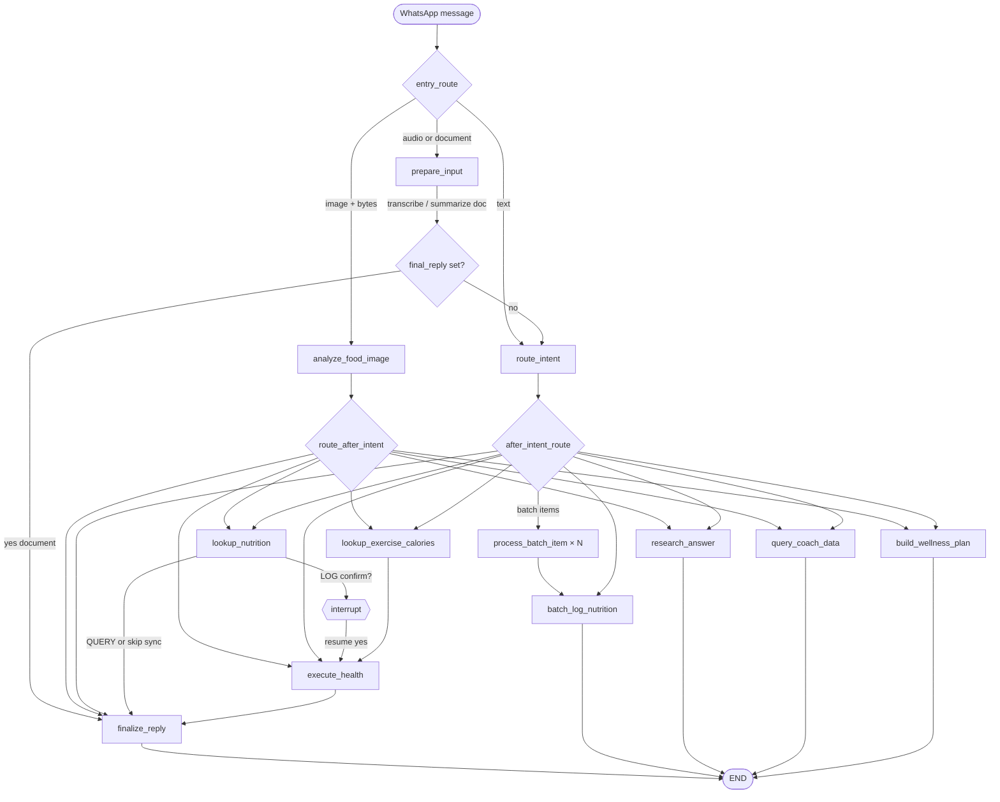

# LLM Calls & LangGraph Workflow

This document explains how the Google Health Coach handles conversation history, assembles prompts, and routes each WhatsApp message through the LangGraph coach graph.

---

## Table of contents

1. [High-level flow](#high-level-flow)
2. [Conversation history: how many previous messages?](#conversation-history-how-many-previous-messages)
3. [Context assembly (`build_llm_context`)](#context-assembly-build_llm_context)
4. [Prompt structure (`_system_prompt` / `_user_prompt`)](#prompt-structure-_system_prompt--_user_prompt)
5. [Every LLM call (`purpose` tag)](#every-llm-call-purpose-tag)
6. [LangGraph: state, entry, nodes, edges](#langgraph-state-entry-nodes-edges)
7. [Per-intent pipelines (LLM count)](#per-intent-pipelines-llm-count)
8. [Interrupts, checkpoints, and resume](#interrupts-checkpoints-and-resume)
9. [Scheduled messages (outside the graph)](#scheduled-messages-outside-the-graph)
10. [Configuration reference](#configuration-reference)

---

## High-level flow

```
WhatsApp webhook
    → run_coach() in webhook_processor
        → LangGraph invoke (thread_id = sender phone)
            → entry: prepare_input | analyze_food_image | route_intent
            → pipeline nodes (nutrition lookup, health write, research, …)
            → finalize_reply (optional 2nd LLM for health queries)
        → record_exchange() persists user + coach reply to SQLite
```

The graph is compiled once (`get_coach_graph()`), with a **SQLite checkpointer** at `data/coach_graph.sqlite3` (or `GRAPH_CHECKPOINT_PATH`). Each user’s phone number is the LangGraph `thread_id`.

---

## Conversation history: how many previous messages?

History is built in `services/memory.py` → `format_history_for_prompt()` and injected into almost every LLm user prompt as `conversation_context`.

### Source of truth

1. **Primary:** SQLite `messages` table via `fetch_recent_messages_for_phone()` — persisted WhatsApp inbound/outbound history.
2. **Fallback:** In-process `deque` per phone (used only when SQLite has no rows for that user).

### Limits

| Setting | Env var | Default | Effect |
|--------|---------|---------|--------|
| Standard turns | `CONVERSATION_MAX_TURNS` | `8` | Fetch up to **16 messages** (`max_turns × 2`) |
| Coaching turns | `CONVERSATION_COACHING_MAX_TURNS` | `16` | Fetch up to **32 messages** when `intent` is a coaching intent |
| Per-line truncation | (hardcoded in `memory.py`) | **600 chars** | Each history line is truncated with `…` |

**Important:** `build_llm_context()` accepts an `intent` parameter so coaching intents can use the longer window, but **the graph never passes `intent` today**. In practice, every graph LLM call uses the **standard 8 turns / 16 messages** unless you wire `intent` through `_llm_context()`.

### What is excluded / labeled

- The **current inbound message** is skipped (matched against `exclude_user_text`) so it is not duplicated in history.
- Messages are formatted **oldest first** under the header `Recent conversation (oldest first):`.
- Scheduled coach messages (morning briefing, workout reminder, etc.) are labeled **`Coach (scheduled)`** so the router can treat replies as follow-ups to nudges.

### What is *not* passed to the LLM

- LangGraph checkpoint state from prior graph runs (except via interrupt resume).
- Raw Google Health API payloads (those are fetched per-node when `include_health_snapshot=True`).
- Full untruncated message text beyond 600 chars per line.

---

## Context assembly (`build_llm_context`)

Defined in `services/llm_context.py`. Called from `graph.py` as `_llm_context(state, include_health_snapshot=…)`.

Returns three string blocks:

| Key | Always? | Contents |
|-----|---------|----------|
| `conversation_context` | Yes | Formatted WhatsApp history (see above) |
| `user_profile_context` | Yes | Age, height, weight, sex — Google Health + `.env` overrides (`USER_PROFILE_*`) |
| `coach_state_context` | Merged | See below |

### `coach_state_context` merge order

When blocks are non-empty, they are joined with `\n\n`:

1. **Coach state** — active fitness plan, goals, recent mood (`format_coach_state_for_prompt`) — **only if** `include_health_snapshot=True`
2. **Nutrition plan** — daily kcal/protein targets + today’s intake progress (`format_nutrition_plan_for_prompt`) — **always** (today’s totals need snapshot when available)
3. **Goal progress** — rollup vs active goals (`format_goal_progress_for_prompt`) — **only if** `include_health_snapshot=True`
4. **Coaching focus** — persistent topic from SQLite (`format_coaching_focus_for_prompt`) — **always**

### `include_health_snapshot` by node

| Node | `include_health_snapshot` | Why |
|------|---------------------------|-----|
| `route_intent` | **false** | Fast routing; still gets nutrition targets + coaching focus |
| `lookup_nutrition` | **false** | Tavily + macro resolve don’t need live Health API rollups |
| `lookup_exercise_calories` | **false** | Same |
| `analyze_food_image` | **true** | Vision benefits from profile + coach context |
| `prepare_input` (document) | **true** | Document Q&A |
| `research_answer` | **true** | Personalized research answers |
| `query_coach_data` | **true** | SQL + summarization |
| `build_wellness_plan` | **true** | Needs 21-day wellness context |
| `finalize_reply` (health queries) | **true** | `summarize_health_data` needs enriched snapshot |
| `batch_log_nutrition` / `process_batch_item` | **true** | Batch path uses full context for macro resolve |

When `include_health_snapshot=False`, the router still receives **nutrition plan targets** and **coaching focus**, but not live Google Health rollups or goal-progress lines.

---

## Prompt structure (`_system_prompt` / `_user_prompt`)

Defined in `agent/engine.py`.

### System prompt

```text
{BASE_SYSTEM_PROMPT}

{coach_state_context}   # optional, appended if non-empty

{user_profile_context}  # optional, appended if non-empty
```

Most specialist prompts (nutrition resolve, research, summarize, vision, etc.) use `_system_prompt(BASE, user_profile_context)` — **coach state is usually only in the user prompt** for those calls, except:

- **Router** — coach state in **both** system and user prompt (duplicate by design for emphasis).
- **Coach DB query** — coach state in system prompt.
- **Wellness plan** — coach state in user prompt.

### User prompt

Built with `_user_prompt(*parts)` — non-empty parts joined by `\n\n`. Nearly always starts with:

```text
{llm_time_context()}   # Current HKT date/time for "today", "yesterday", etc.

{conversation_context}  # Recent messages block (may be empty)

… task-specific blocks …
```

### Router example (`route_message`)

**System:** `ROUTER_SYSTEM_PROMPT` + `user_profile_context` + `coach_state_context`

**User:**
```text
{llm_time_context()}
{conversation_context}
{coach_state_context}        # duplicated here
User message: {user_text}
```

**Output:** JSON `{ intent, payload, conversational_reply }` via `generate_json`, `temperature=0.2`.

Post-router **guards** (no extra LLM) in `graph.py`: no-log phrases, plan vs wellness disambiguation, workout nudge follow-ups, wellness phrasing.

---

## Every LLM call (`purpose` tag)

All calls go through `integrations/llm` and are logged with a `purpose` string.

| `purpose` | Where | System prompt base | Typical user prompt includes |
|-----------|-------|-------------------|------------------------------|
| `route_message` | `AIEngine.route_message` | `ROUTER_SYSTEM_PROMPT` | time, history, coach state, user message |
| `analyze_food_image` | `VisionAgent` | `VISION_SYSTEM_PROMPT` | time, history, caption + **image bytes** |
| `resolve_nutrition_macros` | After Tavily food search | `NUTRITION_RESOLVE_SYSTEM_PROMPT` | time, history, payload, Tavily results (up to ~5k chars JSON) |
| `resolve_exercise_calories` | After Tavily exercise search | `EXERCISE_RESOLVE_SYSTEM_PROMPT` | time, history, payload, Tavily results, weight |
| `answer_research_question` | `research_answer` node | `RESEARCH_SYSTEM_PROMPT` | time, history, draft reply, Tavily results |
| `summarize_health_data` | `finalize_reply` + scheduler | `SUMMARIZE_SYSTEM_PROMPT` | time, history, user question, draft, API JSON (truncated at 12k chars) |
| `summarize_coach_data` | `query_coach_data` node | `SUMMARIZE_COACH_DATA_SYSTEM_PROMPT` | time, history, SQL rows, natural question |
| `generate_coach_db_query` | Inside `lookup_coach_data` retry loop | `COACH_DB_QUERY_SYSTEM_PROMPT` | time, history, question, error hints |
| `generate_fitness_plan` | `actions._handle_local_coach` | Inline fitness plan prompt | time, history, payload |
| `generate_wellness_plan` | `build_wellness_plan` node | `WELLNESS_PLAN_SYSTEM_PROMPT` | time, history, coach state, 21-day context JSON |
| `fix_health_payload` | `actions` on Google Health 400 | `FIX_PAYLOAD_SYSTEM_PROMPT` | error body + original payload |
| *(document)* | `prepare_input` → `summarize_document` | Inline health-doc prompt | time, history, filename, user question + **document bytes** |
| *(audio)* | `prepare_input` → `transcribe_audio` | Provider-specific | **audio bytes** only (no history) |

**Non-LLM tools** used between LLM steps: Tavily (`search_food_nutrition`, `search_health_topic`), Google Health API (`execute_health_action`), SQLite coach DB (`lookup_coach_data`).

---

## LangGraph: state, entry, nodes, edges

### `CoachState` (key fields)

| Field | Role |
|-------|------|
| `user_text`, `sender_phone`, `message_type` | Inbound message |
| `image_*`, `document_*`, `audio_*` | Media inputs |
| `intent`, `payload` | Router output |
| `conversational_reply` | Draft WhatsApp text (router or vision) |
| `vision_result`, `nutrition_search_result`, `research_result` | Pipeline artifacts |
| `api_result` | Google Health or local DB result |
| `batch_results`, `batch_item` | Parallel batch nutrition (`Send` API) |
| `final_reply` | Message sent to user |
| `pending_confirm` | Low-confidence nutrition confirm |

### Entry routing (`entry_route`)



### Nodes (summary)

| Node | LLM? | External I/O |
|------|------|--------------|
| `prepare_input` | Transcribe or document summarize | Gemini audio/doc |
| `analyze_food_image` | Vision | Image → intent + food fields |
| `route_intent` | Router | May skip LLM for log-followup / pending nutrition |
| `lookup_nutrition` | Macro resolve | Tavily → optional **interrupt** → `execute_health` |
| `lookup_exercise_calories` | Exercise calories | Tavily |
| `process_batch_item` | Macro resolve per item | Tavily + Health (parallel via `Send`) |
| `batch_log_nutrition` | N × macro resolve (sequential fallback) | Aggregates replies |
| `research_answer` | Research answer | Tavily |
| `execute_health` | Sometimes `fix_health_payload` on 400 | Google Health + local SQLite |
| `query_coach_data` | SQL gen + summarize | SQLite coach DB |
| `build_wellness_plan` | Wellness plan | 21-day context fetch |
| `finalize_reply` | `summarize_health_data` for query intents | Composes final text |

### Intent routing (`intent_registry.route_after_intent`)

Routing is data-driven from `INTENT_CAPABILITIES`:

| Pipeline | Intents (examples) | Next node |
|----------|-------------------|-----------|
| `research` | `GENERAL_RESEARCH` | `research_answer` → END |
| `coach_data` | `QUERY_COACH_DATA` | `query_coach_data` → END |
| `wellness_plan` | `BUILD_WELLNESS_PLAN` | `build_wellness_plan` → END |
| `document` / `coach_only` | `SUMMARIZE_DOCUMENT`, `COACHING_CHAT` | `finalize_reply` |
| `local` / `health_write` | logs, plans, mood, delete | lookup nodes or `execute_health` |
| `health_query` | `QUERY_HISTORY`, `QUERY_TRENDS`, `QUERY_SLEEP` | `execute_health` → `finalize_reply` |
| `nutrition` | `LOG/UPDATE/QUERY_NUTRITION` | lookup / batch / health / finalize |

**Batch nutrition:** If payload has multiple items and intent supports batch → `Send("process_batch_item")` per item → `batch_log_nutrition` → END (no `finalize_reply`).

**Photo path:** Skips `route_intent`; vision sets `LOG_NUTRITION` vs `QUERY_NUTRITION` from caption + `wants_to_log`.

---

## Per-intent pipelines (LLM count)

Approximate LLM calls per user message (excluding retries and `fix_health_payload`):

| User action | LLM calls | Graph path |
|-------------|-----------|------------|
| General chat (`COACHING_CHAT`) | **1** | route → finalize |
| Log meal (text) | **2** (+ confirm interrupt) | route → lookup_nutrition → execute_health → finalize |
| Query nutrition only | **2** | route → lookup_nutrition → finalize |
| Log meal (photo) | **2** (+ confirm) | vision → lookup_nutrition → … |
| Batch log (e.g. breakfast + coffee) | **1 + N** | route → N × process_batch_item → batch_log_nutrition |
| Log exercise | **2** | route → lookup_exercise_calories → execute_health → finalize |
| Query sleep/steps/trends | **2** | route → execute_health → finalize (`summarize_health_data`) |
| Research question | **2** | route → research_answer |
| Query coach DB | **2–3** | route → generate_coach_db_query (retry) → summarize_coach_data |
| Build wellness plan | **2** | route → generate_wellness_plan |
| Create fitness plan | **2** | route → generate_fitness_plan (in `execute_health` local handler) → finalize |
| Query fitness plan | **1** | route → execute_health (deterministic SQLite) → finalize |
| Voice note | **1–2** | transcribe → route → … |
| PDF document | **1** | summarize_document → finalize (no router) |
| Delete nutrition | **1** | route → execute_health → finalize |

After successful `LOG_NUTRITION`, `finalize_reply` appends a **nutrition progress line** (e.g. `1040/1900 kcal today`) without an extra LLM call.

---

## Interrupts, checkpoints, and resume

### Nutrition confirm (`interrupt()`)

Triggered in `lookup_nutrition` when:

- `nutrition_confidence == "low"`, or
- `calories_kcal > 1200`

Flow:

1. Graph pauses; `final_reply` is the confirm question (via `Command(goto=END)` or interrupt payload).
2. User replies `yes` / `skip` → `run_coach()` calls `graph.invoke(Command(resume=…))`.
3. Pending payload also stored in SQLite (`pending_actions`) for “log it” follow-ups.

### Checkpoint thread

- `thread_id = sender_phone`
- Stale interrupts are abandoned if the user sends unrelated text (`run_coach` logic).
- Log-followup text with pending nutrition bypasses stale interrupt and starts fresh invoke.

### Memory vs checkpoint

| Mechanism | Stores |
|-----------|--------|
| SQLite `messages` | User/coach text for **prompt history** |
| LangGraph checkpoint | Graph state, interrupt pause point |
| `pending_actions` | Nutrition payload awaiting confirm/log |
| In-memory deque | Fallback history if no DB rows |

---

## Scheduled messages (outside the graph)

The APScheduler jobs in `services/coaching.py` call the LLM **directly** (not through LangGraph):

| Job | LLM `purpose` | History in prompt? |
|-----|---------------|------------------|
| Morning briefing | `summarize_health_data` | No conversation block — only profile + health snapshot JSON |
| Evening recap | `summarize_health_data` | Same |
| Weekly recap (Sunday) | `summarize_health_data` | Same |

Scheduled text is written to SQLite `messages` and in-memory history as **`Coach (scheduled)`**, so the **next user reply** includes those lines in `conversation_context` when the router runs.

---

## Configuration reference

```bash
# .env
CONVERSATION_MAX_TURNS=8              # → 16 messages in prompts (default path)
CONVERSATION_COACHING_MAX_TURNS=16    # → 32 messages when intent is passed (not wired in graph yet)
GRAPH_CHECKPOINT_PATH=data/coach_graph.sqlite3

# LLM provider (see .env.example)
LLM_PROVIDER=gemini
GEMINI_MODEL=...
```

### Files to read in the codebase

| Topic | Path |
|-------|------|
| Graph definition | `backend/health_coach/agent/graph.py` |
| Router & all prompts | `backend/health_coach/agent/engine.py` |
| Vision | `backend/health_coach/agent/vision.py` |
| Intent → pipeline map | `backend/health_coach/agent/intent_registry.py` |
| Health/local actions | `backend/health_coach/agent/actions.py` |
| Context builder | `backend/health_coach/services/llm_context.py` |
| History | `backend/health_coach/services/memory.py` |
| Nutrition plan injection | `backend/health_coach/services/nutrition_plan.py` |
| Scheduled LLM summaries | `backend/health_coach/services/coaching.py` |
| Webhook entry | `backend/health_coach/webhook_processor.py` → `run_coach()` |

---

## Quick reference: “How much context does each LLM see?”

| Call | History messages | Profile | Coach / nutrition blocks | Other |
|------|------------------|---------|------------------------|-------|
| Router | Up to **16** | Yes | Targets + focus (no live snapshot) | Current message ×2 in prompts |
| Vision | Up to **16** | Yes | Full snapshot if enabled | Image + caption |
| Nutrition resolve | Up to **16** | Yes | No coach block in system | Tavily JSON |
| Health summarize | Up to **16** | Yes | Full snapshot when `finalize_reply` runs | API JSON up to 12k chars |
| Wellness plan | Up to **16** | Yes | Full merged coach block | 21-day wellness JSON |
| Morning/evening job | **None** | Yes | Via API payload only | Draft + snapshot |

This is the complete picture of how previous messages and context blocks flow into each LLM invocation and how the LangGraph coordinates them end to end.
